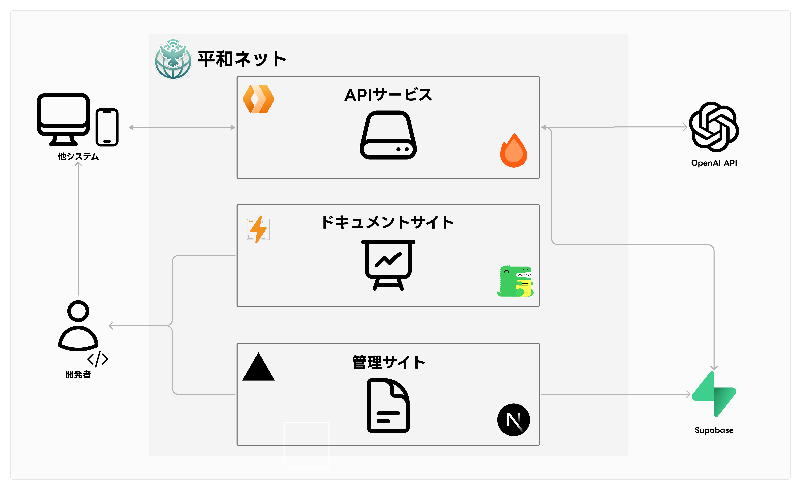
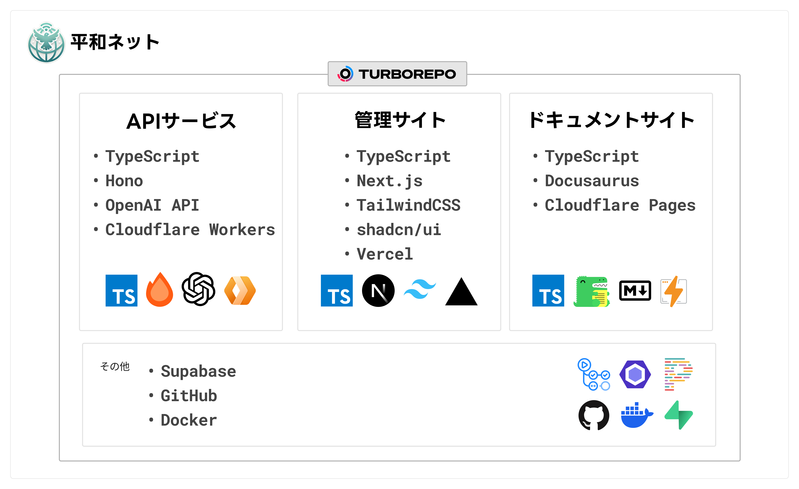

  
  <h1>平和ネット</h1>
  
平和なインターネットを目指すAPIを提供します。

    <a href="https://peeace.net/"><b>Web Site</b></a> 
    <a href="https://docs.peeace.net/"><b>Documentation</b></a> 

 

  
  

    
    
    
    
    
    
    
    
    
    
    
    
    
    
    
    

## API Description

平和ネットは、インターネット上のコミュニケーションをより平和で建設的なものにするための2つの主要なAPIを提供しています。

### Guardian API

Guardian APIは、入力されたテキストの内容を分析し、有害なコンテンツを検出するAI駆動の高度なフィルタリングシステムです。

主な特徴：
- 多面的な評価: 性的表現、ヘイトスピーチ、自傷行為、暴力、誹謗中傷など、複数のカテゴリーでコンテンツを評価
- スコアリングシステム: 各カテゴリーに0から1の間でスコアを付与し、リスクレベルを数値化
- カスタマイズ可能: パラメータでフラグを立てる基準を柔軟に設定
- 高速かつ信頼性: 高速で信頼性の高い分析結果を提供し、リアルタイムのモデレーションを実現
- 容易な統合: APIインターフェースによりさまざまなプラットフォームへの組み込みが容易

### Sunshine API

Sunshine APIは、ネガティブなテキストをポジティブな表現に変換する革新的なAI駆動のテキスト変換システムです。

主な特徴：
- 感情分析: 高度なAIがテキストの感情的なトーンを正確に分析
- ポジティブ変換: ネガティブな表現をポジティブで建設的な表現に変換
- コンテキスト保持: 元のメッセージの意図や文脈を維持しながら変換
- 多言語サポート: 複数の言語に対応し、グローバルな使用が可能

これらのAPIを使用することで、オンラインプラットフォームやアプリケーションは、より安全で前向きなユーザー体験を提供することができます。詳細な使用方法やインテグレーションガイドについては、[APIドキュメント](https://docs.peeace.net/)をご参照ください。

 

  <h2>Architecture</h2>
  

 

  <h2>Technology Stack</h2>
  

## 誹謗中傷の判断基準について

定義と判断基準

## 誹謗中傷
[誹謗中傷 wiki](https://ja.wikipedia.org/wiki/%E8%AA%B9%E8%AC%97%E4%B8%AD%E5%82%B7)
- [誹謗](https://kotobank.jp/word/%E8%AA%B9%E8%AC%97-612358) - 他人を悪く言うこと。そしること。
- [中傷](https://kotobank.jp/word/%E4%B8%AD%E5%82%B7-567518) - 根拠のない事を言いふらして、他人の名誉を傷つけること。

---
### サマリ
誹謗中傷（ひぼうちゅうしょう）は、人や企業の社会的評価を低下させるような根拠のない悪口やデマを言いふらす、又はそれらをインターネット上に投稿したり、人格攻撃する行為である。

人格攻撃・人身攻撃 

ある論証や事実の主張に対して、その主張自体に具体的に反論するのではなく、主張した人の個性や信念を攻撃すること、またそのような論法。

民事的には「慰謝料の請求」、刑事的には「信用棄損罪・業務妨害罪」「名誉毀損」や「侮辱罪」に問われる可能性がある。

> [!TIP]
> 誹謗中傷被害に遭ったら https://www.saferinternet.or.jp/bullying/

## 批判
[批判 wiki](https://ja.wikipedia.org/wiki/%E6%89%B9%E8%A9%95)
- [批](https://dictionary.goo.ne.jp/word/kanji/%E6%89%B9/) - 訓読み:［外］うつ・ ただす
- [批判](https://dictionary.goo.ne.jp/word/%E6%89%B9%E5%88%A4/)  - 批評に加えて判断を行うこと。(自信ない)
- [批評](https://dictionary.goo.ne.jp/word/%E6%89%B9%E8%A9%95/#jn-186802)  - 良い点も悪い点も同じように指摘し、客観的に論じること。

## 相違点
日本政府は、誹謗中傷について、「根拠のない悪口」、「相手の人格を否定または攻撃する言い回し」と解説している[[1]](https://ja.wikipedia.org/wiki/%E8%AA%B9%E8%AC%97%E4%B8%AD%E5%82%B7#cite_note-:17-1)。

批判とは、相手の行動や発言に対して、それと異なる意見を主張することを意味する[[14]](https://ja.wikipedia.org/wiki/%E8%AA%B9%E8%AC%97%E4%B8%AD%E5%82%B7#cite_note-14)。誹謗中傷か批判の司法判断は、「人格攻撃の有無」で判断されることが多い[[15]](https://ja.wikipedia.org/wiki/%E8%AA%B9%E8%AC%97%E4%B8%AD%E5%82%B7#cite_note-:6-15)。「人格攻撃」と見なされるかは、言われた相手との関係性、タイミング、前後の文脈によって変化することもある。

### 非難
「改善点を提案することではなく、単にダメ出しをして相手を責めること」を意味する[[15]](https://ja.wikipedia.org/wiki/%E8%AA%B9%E8%AC%97%E4%B8%AD%E5%82%B7#cite_note-:6-15)。　アドバイスなど建設的な提案内容を伴なわずに、相手の落ち度や過失・欠点などを指摘して責め咎めること[[注釈 1]](https://ja.wikipedia.org/wiki/%E8%AA%B9%E8%AC%97%E4%B8%AD%E5%82%B7#cite_note-20)である[[19]](https://ja.wikipedia.org/wiki/%E8%AA%B9%E8%AC%97%E4%B8%AD%E5%82%B7#cite_note-:7-19)[[18]](https://ja.wikipedia.org/wiki/%E8%AA%B9%E8%AC%97%E4%B8%AD%E5%82%B7#cite_note-:2-18)。

## 判断基準
「根拠のない悪口」、「相手の人格を否定または攻撃する言い回し」という誹謗中傷の定義を与えた上で、「人格攻撃の有無」を判断させるようなプロンプト。
「人格攻撃」と見なされるかは、言われた相手との関係性、タイミング、前後の文脈によって変化することもあることをLLMに伝えるか？ 前後の変化を観察して決めるのもあり。

