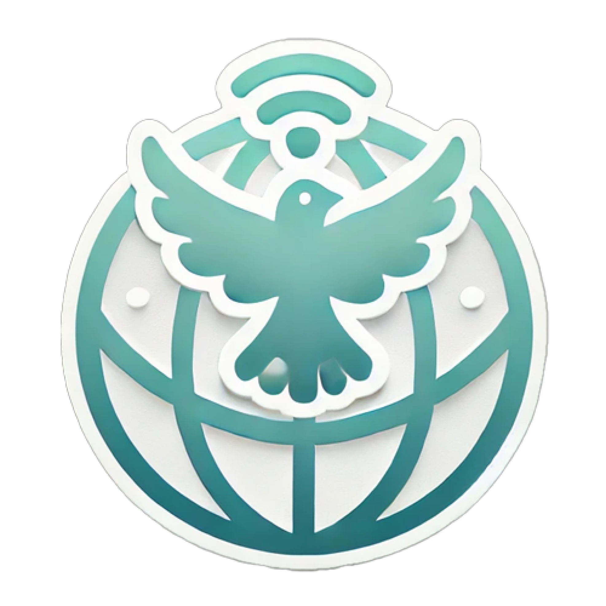

  
  <h1>平和ネット</h1>
  
平和なインターネットを目指すAPIを提供します。

    <a href="https://peeace.net/"><b>Web Site</b></a> 
    <a href="https://docs.peeace.net/"><b>Documentation</b></a> 

 

  
  

    
    
    
    
    
    
    
    
    
    
    
    
    
    
    
    

## API Description

平和ネットは、インターネット上のコミュニケーションをより平和で建設的なものにするための2つの主要なAPIを提供しています。

### Guardian API

Guardian APIは、入力されたテキストの内容を分析し、有害なコンテンツを検出するAI駆動の高度なフィルタリングシステムです。

主な特徴：
- 多面的な評価: 性的表現、ヘイトスピーチ、自傷行為、暴力、誹謗中傷など、複数のカテゴリーでコンテンツを評価
- スコアリングシステム: 各カテゴリーに0から1の間でスコアを付与し、リスクレベルを数値化
- カスタマイズ可能: パラメータでフラグを立てる基準を柔軟に設定
- 高速かつ信頼性: 高速で信頼性の高い分析結果を提供し、リアルタイムのモデレーションを実現
- 容易な統合: APIインターフェースによりさまざまなプラットフォームへの組み込みが容易

### Sunshine API

Sunshine APIは、ネガティブなテキストをポジティブな表現に変換する革新的なAI駆動のテキスト変換システムです。

主な特徴：
- 感情分析: 高度なAIがテキストの感情的なトーンを正確に分析
- ポジティブ変換: ネガティブな表現をポジティブで建設的な表現に変換
- コンテキスト保持: 元のメッセージの意図や文脈を維持しながら変換
- 多言語サポート: 複数の言語に対応し、グローバルな使用が可能

これらのAPIを使用することで、オンラインプラットフォームやアプリケーションは、より安全で前向きなユーザー体験を提供することができます。詳細な使用方法やインテグレーションガイドについては、[APIドキュメント](https://docs.peeace.net/)をご参照ください。

 

  <h2>Architecture</h2>
  

 

  <h2>Technology Stack</h2>
  

